# File Manager Discord
## What is the purpose of this program ?

This program is made for a Discord bot. Its purpose is to organize the messages sent in a clear and structured way, thanks to files and directories. The whole database is made in XML. However, people do not interact directly with this database, but write commands on a channel, which are processed by the bot to interact with the XML file. The commands are simple and inspired by bash.

## The commands
### ls
As in bash, this command allows to see the files that are in the directory.

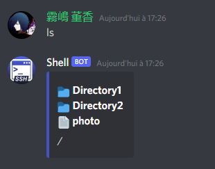

Syntax: `ls`

### cd
As in bash, this command allows you to change of directory

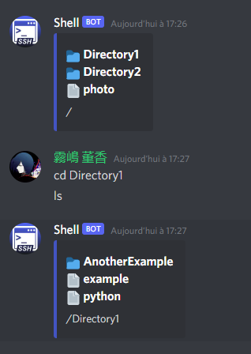

Syntax: `cd`

### cd..
cd.. is the equivalent of "cd .." in Bash

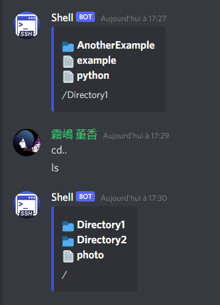

Syntax: `cd..`

### mkdir
As in bash, this command allows you to make a new directory

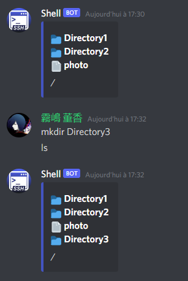

Syntax: `mkdir {name_of_the_dir}`

### mkdir
As in bash, this command allows you to make a new directory

Syntax: `mkdir {name_of_the_dir}`

### home
This command allow user to come to the root of all the database. It's kind of a big cd..

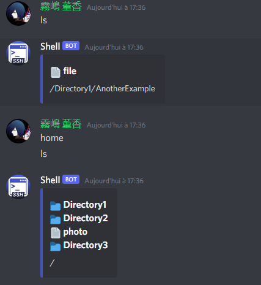

Syntax: `home`

### pwd
As in bash, this command allows you to get your current location. You can also see it with ls at the bottom

Syntax: `pwd`

### touch

This command isn't the same as in Bash. This command creates a "file" (which is just a tag for the XML), and maps the ID of a discord message to it. If you don't understand the utility of that, you'll understand it with the next command `c`

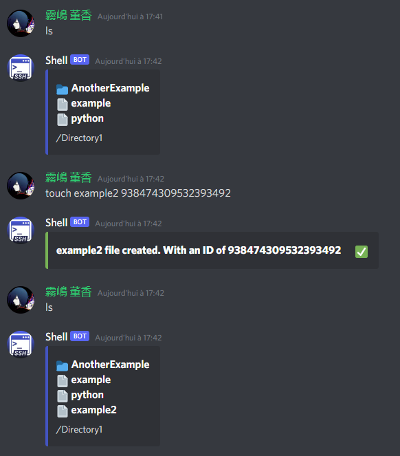

Syntax: `touch {name_of_the_file} {id_of_the_message}`

### c
The command c (see) allows user to see the "content" of a file. Because we created a file with the ID of a message in it, this command, will show the message that correspond to the ID

Syntax: `c {name_of_the_file}`

### mdid
It is possible that the ID you entered is wrong. To change this id you can use the command mdid

Syntax: `mdid {name_of_the_file} {new_id_of_the_message}`

### rm
You want to delete a file or a directory? No problem, the rm command allows you to do that

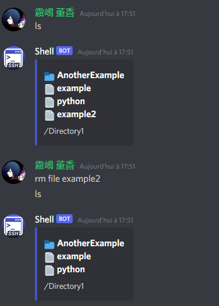

Syntax: `mdid {type (dir or file)} {name}`

### rn
If you are mistaken about the name of a file and want to rename it you can use the command rn

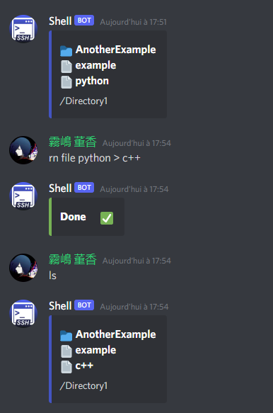

Syntax: `rn {type (dir or file)} {actual_name} > {new_name}`

### mv
You want to move a file or even a directory to another location? Use mv

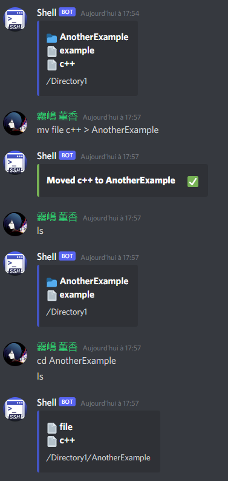

Syntax: `mv {type (dir or file)} {name_of_the_file_or_dir_you_want_to_mv} > {dir}`

### mv..
This command is the same as cd.. for cd but for mv. If you want to move a file or a directory to the directory before the one you are in, use mv.

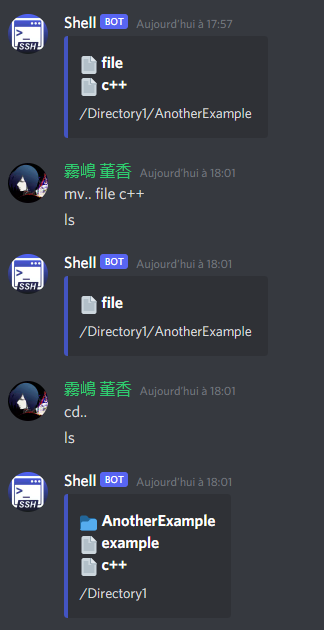

Syntax: `mv.. {type (dir or file)} {name_of_the_file_or_dir_you_want_to_mv}`

### help
This is the final command. This command can be used if you don't know what to do or if you don't know the use of a command and can be used in two ways
#### Just help
If you only write "help". You'll see the list of commands. (I added a (- ADMIN) for this example, but didnt implemented it)

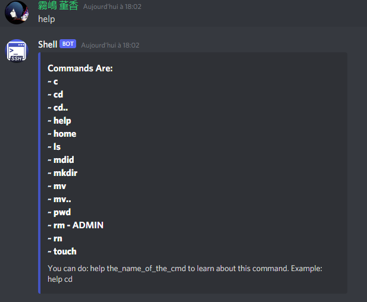

Syntax: `help`

#### help + cmd
However, if you want to have more information about a command, you can write help + the command

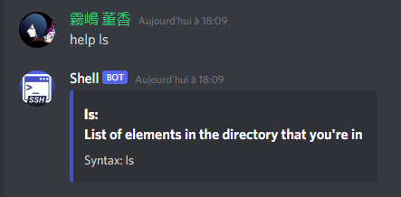

Syntax : `help {cmd}`

## Extensions I used
### ETREE
The xml.etree.ElementTree module implements a simple and efficient API for parsing and creating XML data. This is normally already installed with Python. More information here:
https://docs.python.org/3/library/xml.etree.elementtree.html

### Discord
Since the bot is on Discord, we logically use Discord.py
if you want to install it:

https://pypi.org/project/discord.py/

Documentation:

https://discordpy.readthedocs.io/en/latest/
